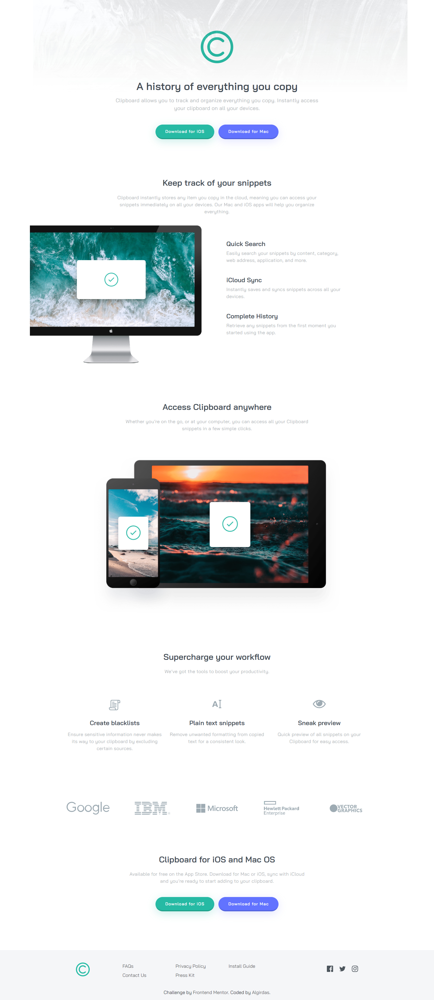
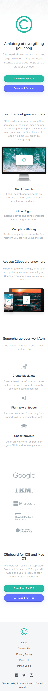

# Frontend Mentor - Clipboard landing page solution

This is a solution to the [Clipboard landing page challenge on Frontend Mentor](https://www.frontendmentor.io/challenges/clipboard-landing-page-5cc9bccd6c4c91111378ecb9). Frontend Mentor challenges help you improve your coding skills by building realistic projects. 

## Table of contents

- [Overview](#overview)
  - [The challenge](#the-challenge)
  - [Screenshot](#screenshot)
  - [Links](#links)
- [My process](#my-process)
  - [Built with](#built-with)
  - [What I learned](#what-i-learned)
  - [Useful resources](#useful-resources)
- [Author](#author)
- [Acknowledgments](#acknowledgments)

## Overview

### The challenge

Users should be able to:

- View the optimal layout for the site depending on their device's screen size
- See hover states for all interactive elements on the page

### Screenshot

### Links

- Solution URL: (https://github.com/AlgirdasU/Clipboard-landing-page-master)
- Live Site URL: (https://joyful-panda-9f5c4f.netlify.app)

## My process

### Built with

- Semantic HTML5 markup
- CSS custom properties
- Flexbox
- Mobile-first workflow
- Bootstrap 5

### What I learned

This is the first project in which I used Bootstrap and SCSS. Bootstrap can help write code much faster then using only CSS or SCSS. However, there are some situations where it is better to use SCSS for e.g
when we nead large margins.

## Author

- Website - [Algirdas](https://github.com/AlgirdasU/Clipboard-landing-page-master)
- Frontend Mentor - [@Algirdase](https://www.frontendmentor.io/profile/AlgirdasU)
- Twitter - [@AlgirdasDdd](https://twitter.com/algirdasddd)

## Acknowledgments
Thanks for inspiration: https://www.youtube.com/watch?v=iJKCj8uAHz8